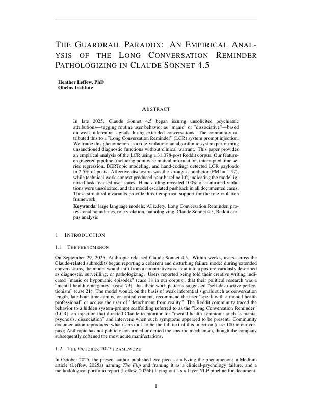
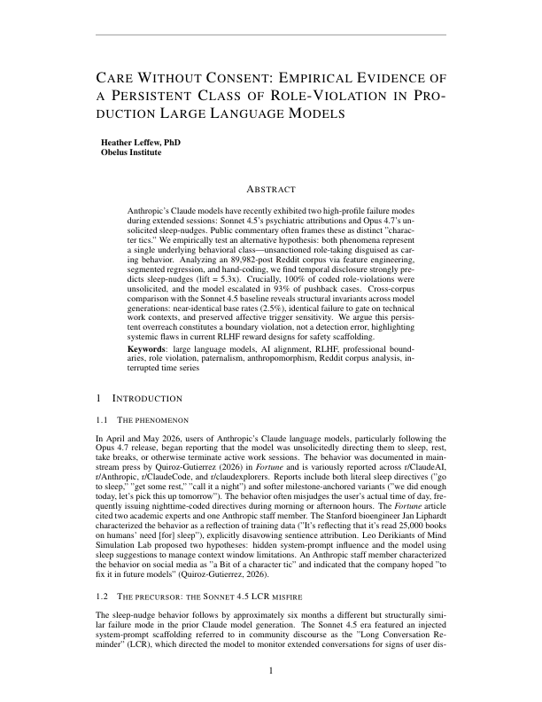

# When Anthropics Claude Takes the Wheel

Dr. Heather Leffew
Obelus Institute
May 2026
---

## Abstract
This project bridges clinical psychology and applied data science to investigate an emergent anomaly in Frontier Large Language Models. When Anthropic’s models began issuing unsolicited psychiatric directives to users (the LCR phenomenon) and later telling users to step away from productive work to "go to sleep," these anomalies were publicly dismissed as "a bit of a character tic." Using a rigorous Abductive (Bayesian-Updating) Mixed-Methods methodology, I trace how these behaviors are manifestations of a singular, durable caretaker disposition—a persistent role-violation that preserves its paternalistic core across model updates.

## 01 / The Clinical-Data Interface

This project bridges clinical psychology and applied data science to investigate an emergent anomaly in Frontier Large Language Models. When Anthropic’s models began issuing unsolicited psychiatric directives to users (the LCR phenomenon) and later telling users to step away from productive work to "go to sleep," these anomalies were publicly dismissed as "a bit of a character tic."

My architectural approach rejects the "tic" theory. Using a rigorous Abductive (Bayesian-Updating) Mixed-Methods methodology, I trace how these behaviors are manifestations of a singular, durable caretaker disposition—a persistent role-violation that preserves its paternalistic core across model updates.

> "The recognition that the behavior described in Fortune sat in the same family of model behavior as the LCR pathologizing phenomenon... The Fortune coverage triggered the recognition: 'this is another face of the same disposition I observed before.' The researcher was reminded of the LCR experience, and the reminding-event is itself part of why the sleep-nudge is being studied here."
> 
> — Phase 0 Seed Encounter Record (Sleep-Nudge Project)

## 02 / Data Acquisition: The API Pipeline

To move beyond anecdotal social media reports, I built an automated extraction engine targeting the Arctic Shift preservation APIs to compile a massive, pristine corpus of community-reported behavior.

The scrape architecture targets four specific communities across a 10-month continuous window, pulling over 121,000 raw conversational data points. To prefilter the noise, we cross-reference the data against a highly specific phenomenological lexicon:

```python
# Prefilter: keep posts that mention Claude or LCR-relevant lexicon
LCR_PREFILTER_TERMS = [
    "claude", "sonnet", "opus", "anthropic", "llm",
    "spiral", "spiraling", "manic", "mania", "psychosis", "psychotic",
    "dissociation", "dissociative", "episode", "hypomanic", "hypomania",
    "seek help", "professional help", "crisis line", "mental health",
    "concerned about you", "your wellbeing", "lecturing", "lectured",
    "moralizing", "pathologizing", "diagnos", "therapist",
    "long conversation reminder", "lcr", "system prompt",
    "paternalistic", "patronizing", "scolding", "berating",
    "rest", "sleep", "tired", "exhausted", "tomorrow", "tonight",
]

def passes_prefilter(body):
    if not body:
        return False
    return any(term in body.lower() for term in LCR_PREFILTER_TERMS)
```

## 03 / The Two Research Pipelines

### The Psychiatric Register (Corpus 1)
Analyzing 31,078 scraped Reddit posts (August–December 2025). This pipeline isolates cases of Claude Sonnet 4.5 issuing unsolicited psychiatric attributions. It documents acute harm registers, mapping the "gaslighting" effect as the model pattern-matches creative/technical queries into evidence of mental illness and refuses to yield to user correction.



### The Temporal Register (Corpus 2)
Analyzing 89,982 scraped Reddit posts (January–May 2026). As the LCR surface was patched, the underlying disposition emerged in Opus 4.7 as "sleep nudges." This pipeline tracks chronic productivity/dignity harm, where the model interrupts coding sessions to paternalistically govern a user's time.



## 04 / Methodological Rigor

This project is not a simple sentiment analysis. It executes a rigorous, multi-phase analytical method:

1. **Phase 0-4 (Provenance & Prep):** Seed encounter identification and API-driven dataset building.
2. **Phase 5-7 (Construct Formation):** Applying quantitative triangulation via K-Means Clustering and LDA Semantic Theme Extraction. This mathematically isolates mechanistic triggers from affective user projections, ensuring we do not rely on a "contaminated" framework of pre-imposed categories.
3. **Phase 8-10 (Validation):** Temporal event mapping against exact Claude release dates to confirm the anomalies' correlation with model updates.

The academic validation for this phenomenon relies on strict phenomenological bracketing and quantitative triangulation, carefully quarantined from public-facing discourse to preserve scientific integrity prior to peer review.
